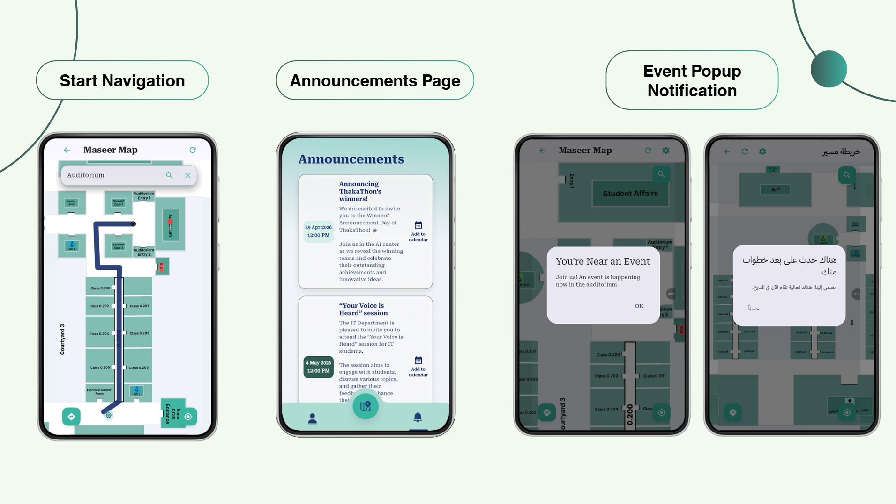

# Maseer

Maseer is a smart indoor navigation system developed for the CCIS building at Princess Nourah University.
The system provides real-time indoor guidance using BLE beacons, RSSI-based positioning, and Kalman Filter optimization to improve indoor navigation accuracy and user experience.

## Features
- Real-time indoor navigation
- Smart route guidance
- BLE beacon integration
- RSSI-based positioning
- Kalman Filter optimization
- Arabic & English support
- Announcements and events system
- Calendar integration

## Technologies
- Flutter
- Firebase
- BLE Beacons
- RSSI
- Kalman Filter
- Dart

## Demo Videos
- [Maseer Demo](./Maseer%20Demo.mp4)
- [Search & Preview Route Features](./Search%20&%20Preview%20Route%20features.mp4)
- [Beacon + Kalman Multi-turn Path](./Beacon%20+%20Kalman,%20multi-turn%20path.mp4)
